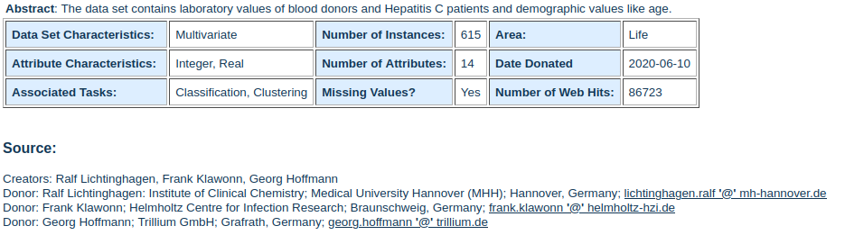
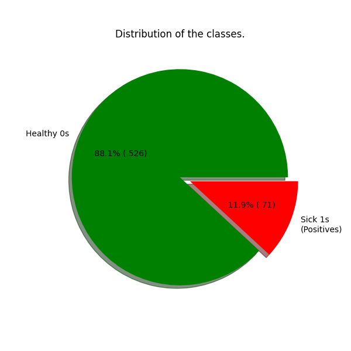

# HCV_Classifier

Using supervised learning techniques in AI to classify individuals as healthy or infected with Hepatitis C based on labeled data.

This repository contains a machine learning classification task applied to the HCV dataset from the UCI Machine Learning Repository (https://archive.ics.uci.edu/ml/datasets/HCV+data).

Our goal is to use various machine learning techniques to accurately classify individuals as healthy or infected with Hepatitis C based on the provided data. We will be using a Jupyter Notebook as our working environment.

One of our main objectives is to achieve high accuracy in classifying positive cases (Hepatitis C patients). However, we face some challenges such as class imbalance and the presence of missing values (NaNs) in the dataset.

We will explore different approaches to address these challenges and improve the performance of our classification model.